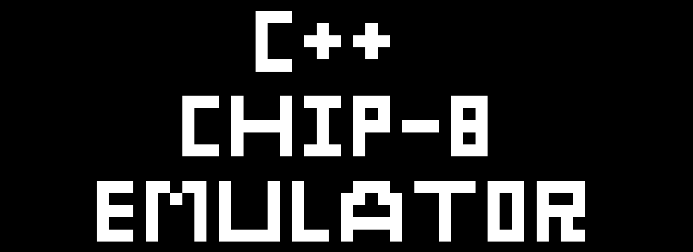
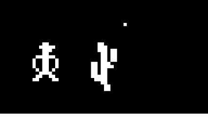

<div align="center">
    
</div>

This project is a fully functional emulator for the CHIP-8 system written in C++ to run `.ch8` roms. 



## Background

CHIP-8 is an interpreted programming language from the 70s that was used on 8-bit microcomputers like the COSMAC VIP and the Telmac 1800 to run games. I built this emulator as a way to strengthen my C++ skills and my understanding of computer architecture. 

## Features

-   **Instruction Set:** Implements all 35 CHIP-8 opcodes for full ROM compatibility.
-   **SDL2:** Uses SDL2 library to handle rendering, sound, and keyboard input.
-   **Display:** Renders the original 64x32 monochrome display in an upscaled 640x320 window.
-   **Keyboard:** Maps the 16-key hexadecimal keypad to a standard QWERTY layout for input.
-   **Memory:** 4 kB of virtual memory.
-   **Registers:** 16 8-bit general-purpose registers (`V0` to `VF`).
-   **Program Counter (PC):** Points to the next instruction to execute.
-   **Index Register (I):** Stores memory addresses for various operations.
-   **Stack:** A 16-level stack to handle subroutine calls.
-   **Timers:** Includes a delay timer and a sound timer that decrement at 60Hz.
-   **Clock Speed:** The CPU runs at approximately 720Hz. The main event loop is synchronized to the display's refresh rate to keep game speeds consistent.
-   **ROM Loading:** ROMs are loaded into the emulator by providing the file path as a command-line argument.
-   **Fontset:** The original hexadecimal font (0-F) required by CHIP-8 is pre-loaded into the emulator's memory.

## Building and Running

This project uses a `Makefile` and requires a system-wide installation of SDL2.

### Prerequisites

Before building, you must install the SDL2 development library. The recommended way on Windows is to use MSYS2.

1.  **Open the `MSYS2 MINGW64` terminal.**
2.  **Install SDL2** using the `pacman` package manager:
    ```bash
    pacman -S mingw-w64-x86_64-SDL2
    ```

For other operating systems:
-   **macOS (with Homebrew)**: `brew install sdl2`
-   **Debian/Ubuntu**: `sudo apt-get install libsdl2-dev`

This setup ensures that the `sdl2-config` tool is available in your shell's `PATH`.

### Build, Run, and Clean

Navigate to the project's root directory in your terminal (e.g., `MSYS2 MINGW64` on Windows) and use the following commands:

-   **Build the executable**:
    ```sh
    make
    ```
    *(On Windows, this command is equivalent to `mingw32-make` inside the correct MSYS2 terminal).*

-   **Run the emulator**:
    ```sh
    make run
    ```

-   **Clean build files**:
    ```sh
    make clean
    ```

### Optional: Compiling Directly in PowerShell

If you prefer to use PowerShell instead of the MSYS2 terminal, you can do so by performing a one-time setup to add the MinGW tools to your system's `PATH`.

**1. Find your MinGW `bin` directory**

This directory is located inside your MSYS2 installation folder. The default location is:
`C:\msys64\mingw64\bin`

**2. Add the directory to your Windows PATH**

a. In the Windows search bar, type "environment" and select **Edit the system environment variables**.
b. In the System Properties window, click the **Environment Variables...** button.
c. In the top "User variables" section, select the `Path` variable and click **Edit...**.
d. Click **New** and paste the path to your MinGW `bin` directory (e.g., `C:\msys64\mingw64\bin`).
e. Click OK on all the windows to save the changes.

**3. Restart PowerShell**

You must open a **new** PowerShell terminal for the changes to take effect.

**4. Build and Run**

Now you can use the `mingw32-make` command directly in PowerShell:

-   **Build**: `mingw32-make`
-   **Run**: `mingw32-make run`
-   **Clean**: `mingw32-make clean`
